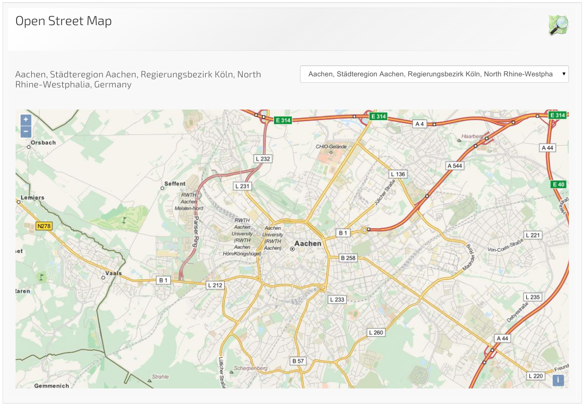

# OpenStreetMapWidget

> A widget displaying results found on openstreetmap.org.


## Content

* [Appearance](#appearance)
* [Usage](#usage)
* [References](#references)


## Appearance




## Usage

### Installation

For installation instruction take a look at the [LaxarJS documentation](https://github.com/LaxarJS/laxar/blob/master/docs/manuals/installing_widgets.md).


### Configuration example

```json
{
   "widget": "finder-demo/open-street-map-widget",
   "features": {
      "search": {
         "resource": "searchString"
      }
   }
}
```
Use this configuration on a page to get a OpenStreetMapWidget instance.
The `search` resource is expected to provide searches for locations.

Alternatively, this widget may be connected to a *GeocodingActivity*, already providing a list of locations to show a map for.
Assuming the *GeocodingActivity* publishes its result list as `availableLocations` and its search pending flag as `geocodingInProgress`, the following configuration can be used:

```json
{
   "widget": "finder-demo/open-street-map-widget",
   "features": {
      "search": {
         "resource": "searchString"
      },
      "locations": {
         "resource": "availableLocations",
         "searchingOn": [ "geocodingInProgress" ]
      }
   }
}
```

Note that the configuration for the `search.resource` feature is still required.
This is enables the widget to keep track of the result status, i.e. if no search was started or no results were found.

When activating multiple widgets using geocoding the combination with a *GeocodingActivity* is advised.
It will reduce the number of requests made to the service and provide a consistent list of result locations.


## References

The following resources are useful or necessary for the understanding of this document.
The links refer to the latest version of the documentation.
Refer to the bower.json for the specific version that is normative for this document.

* [LaxarJS Concepts]
* [LaxarJS Patterns]

[LaxarJS Concepts]: https://github.com/LaxarJS/laxar/blob/master/docs/concepts.md "LaxarJS Concepts"
[LaxarJS Patterns]: https://github.com/LaxarJS/laxar_patterns/blob/master/docs/index.md "LaxarJS Patterns"

...
